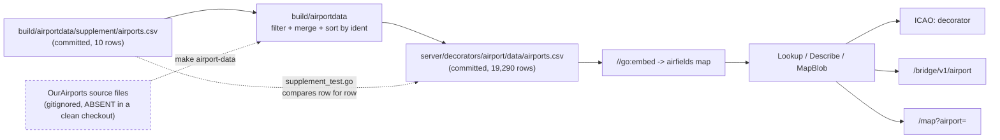

# fix: add the PLWF demo airfield and correct PTWF's position

## Summary

The Iron Fortress supplement ships ten fictional airfields. The
`indigo-mm-standard-v3` map handoff, which is the authority for the demo world,
says there are eleven and that one of the ten is in the wrong place. This plan
adds `PLWF` (Lonewatch, the Wake Island stand-in) and moves `PTWF` off the
coordinates it copy-pasted from `PGPC`, 3.2 km from the runway its artwork
draws. It then moves every count and every "ten" statement that follows from an
eleventh row, and adds the test that would have caught the error in the first
place.

This is data, not logic. Nothing in the decorator, the bridge, the map route or
the generator changes.

---

## Problem Frame

Commit `f69822f` (PR #72) added the ten demo airfields by copying the
`(DEMO-DATA)` rows out of the Ops Center plugin's `assets/airport-codes.csv`.
Diffing the shipped data against the v3 handoff turns up exactly two real
disagreements:

| field | handoff | shipped | offset |
|---|---|---|---|
| RWBF | 26.351667, 127.769444 | 26.3517, 127.7694 | 6 m |
| RVGF | 15.1859, 120.5603 | 15.1860, 120.5600 | 34 m |
| PORF | 7.3673, 134.5443 | 7.3673, 134.5442 | 11 m |
| PNTF | 13.584, 144.929998 | 13.5840, 144.9300 | 0 m |
| **PTWF** | **21.3187, -157.9224** | **21.3353, -157.9483** | **3,256 m** |
| **PLWF** | **19.2820, 166.6360** | **absent** | **n/a** |

The first four are rounding between a four-decimal handoff table and the
four-decimal embedded data. They are not defects and this plan does not touch
them.

`PTWF` carries coordinates byte-identical to `PGPC`. `PNTF` and `PFRC` are
likewise identical to each other. Two pairs share one coordinate each, and
`PTWF` took the wrong half of its pair. The map still draws a pin, because both
points fall inside the same pack's bounds; it just does not put it on the
illustrated runway.

`PLWF` is absent entirely. It is the handoff's headline v3 addition, it predates
this repo's supplement in AMPLIFI's scenario fields, and `demo-plwf.pmtiles`
ships with artwork centred on it. Today the airfield decorator cannot resolve
the ident, so `PLWF` in a message decorates as nothing and `/map?airport=PLWF`
has nothing to open.

### Coordinates are scenario-frame values

Stated plainly because it is the thing most likely to be "corrected" by a later
pass. The handoff's coordinates came first and the artwork was built to them.
Each regional image is shifted so its visible runway midpoint matches the
existing coordinate. The fields sit near the real fields they stand in for, but
they are not those fields' positions, and the drawings are fictional with no
Earth imagery or OSM geographic data behind them.

**Do not reconcile any demo coordinate against the real-world ICAO it masks, and
do not round or re-derive one.** `21.3187, -157.9224` is not `PHIK`'s documented
position and is not supposed to be. After the correction `PTWF` lands about
250 m from `PCMN`, which is what the scenario frame intends; `PNTF` and `PFRC`
already share one coordinate exactly.

---

## Requirements

- **R1.** `PLWF` resolves through `Lookup`, parses to its own link, decorates
  behind a label, and answers on `/bridge/v1/airport?ident=PLWF`.
- **R2.** `PTWF` reads `21.3187,-157.9224` in both CSVs and no longer equals
  `PGPC`.
- **R3.** The supplement and the embedded file agree row for row, so
  `TestTheDemoAirfieldsResolve` stays green.
- **R4.** Every demo field's coordinates are pinned to the handoff table by a
  test, so the next copy-paste slip is caught by the suite rather than by SME
  review.
- **R5.** Every stated airfield count and every "ten demo airfields" statement
  in the tree moves to 19,291 / eleven. The `603` and `349` figures do not move.
- **R6.** The four rounding disagreements are left exactly as they are.

---

## High-Level Technical Design

The supplement is upstream of the embedded file, and the embedded file is
upstream of everything a reader sees. The generator that joins them cannot run
offline, which is what makes the hand-splice question load-bearing.



Because the generator's last step is `sort.Slice` on the ident, a hand-spliced
row inserted at its sorted position produces a file byte-identical to a
regeneration. `PLWF` sorts between `PLPA` (line 10285) and `PLWN` (line 10286),
so the insertion point is line 10286. The dashed `supplement_test.go` edge is
what keeps the hand-splice honest: if the two files drift by a single character,
`TestTheDemoAirfieldsResolve` fails.

---

## Key Technical Decisions

**KTD1 - Hand-splice both CSVs rather than regenerate.** `make airport-data`
reads `build/airportdata/source/`, which is gitignored and absent in a clean
checkout; regenerating means re-fetching three OurAirports files at the pinned
commit `3b27dacfa7700507e03401f2df024a1b1670d312`. The generator sorts by ident,
so the hand-splice is byte-identical, and `TestTheDemoAirfieldsResolve` fails on
any drift between the two files. Regeneration remains valid for anyone who has
the sources; it is not required.

**KTD2 - Land without waiting for Ops Center**
*(session-settled: user-directed - chosen over gating the commit on the
`mattermost-plugin-aocanywhere` merge: the SME confirmed both the coordinates
and the Lonewatch name, and this side's value is independent of which map packs
ship.)* The origin notes direct the Ops Center change to land first, since
`server/decorators/airport/data/README.md` records that the supplement values
were copied from that plugin's `assets/airport-codes.csv`. That ordering is
deliberately dropped here. The copy-direction claim in the README stays true as
a statement of provenance; the two repos reconcile on Ops Center's next pass.
The one inferred value is the `Field` suffix - see Risks.

**KTD3 - The four rounding disagreements are not defects.** RWBF, RVGF, PORF
and PNTF differ from the handoff by 0 to 34 m, which is the handoff table
quoting more decimals than the four the generator rounds to. Touching them would
be re-deriving a coordinate, which the scenario frame forbids.

**KTD4 - Pin the demo coordinates to the handoff with a table test**
*(session-settled: user-approved - chosen over bumping only the row count, and
over a weaker no-two-idents-share-a-coordinate check that `PNTF`/`PFRC` would
need an allowlist for.)* Nothing in the tree currently holds the supplement to
the handoff, which is how a 3.2 km error survived a green suite. Pack
containment would not have caught it either: the pre-change `PTWF` also falls
inside `demo-ptwf`'s bounds.

**KTD5 - The doc sweep covers three statements the origin notes missed; the
provenance wording stays** *(session-settled: user-directed - chosen over also
rewriting "at or beside a real field in the same area" to scenario-frame
wording.)* Research found `server/decorators/airport/data/README.md:100`, `:136`
and `:138` carry "ten" statements the notes' table does not list. They are in
scope. The provenance sentence at `:104-105` is left exactly as written.

**KTD6 - `PLWF` mirrors `PWAK`'s non-positional attributes only.** `UM` /
`UM-79` / elevation `14`, the way `PORF` mirrors Palau's. Four fields only: the
coordinates come from the handoff, never from `PWAK`. No IATA code (`PWAK`
carries `AWK`; a demo field never does) and no `military` designator.

---

## Implementation Units

### U1. Add PLWF and correct PTWF in both CSVs, and bump the row-count test

**Goal:** The eleventh demo airfield exists and `PTWF` is in the right place.

**Requirements:** R1, R2, R3, R6.

**Dependencies:** none.

**Atomicity:** these three edits must land together. Any subset is a red suite:
`TestTheDemoAirfieldsResolve` asserts `len(rows) != 10` *and* compares the
supplement against the embedded file row for row, so editing one CSV without the
other, or either CSV without the count, fails.

**Files:**
- `build/airportdata/supplement/airports.csv`
- `server/decorators/airport/data/airports.csv`
- `server/decorators/airport/supplement_test.go`

**Approach:**

The supplement's columns are
`ident,type,name,municipality,iso_country,iso_region,iata_code,elevation_ft,lat,lon,military`.
The new row is:

```
PLWF,medium_airport,Lonewatch Field (DEMO-DATA),Lonewatch,UM,UM-79,,14,19.2820,166.6360,
```

In the supplement it sorts between `PGPC` and `PNTF`. In the embedded file it
sorts between `PLPA` and `PLWN`, inserting at line 10286 (verified against the
current file). `PTWF`'s `lat,lon` change from `21.3353,-157.9483` to
`21.3187,-157.9224` in both files; nothing else on that row moves.

In `supplement_test.go:36-38`, `if len(rows) != 10` becomes `11` and the failure
message "want the ten demo airfields" becomes eleven.

**Patterns to follow:** the nine sibling supplement rows. `PORF` is the closest
analogue for the mirror-the-host-territory pattern (`PW` / `PW-004`, elevation
from Palau, no IATA, no military).

**Test scenarios:**
- Covers R3. `TestTheDemoAirfieldsResolve` passes with eleven rows: each ident
  resolves through `Lookup`, the supplement row equals `embeddedRow(a)`
  character for character, each parses to a link whose `v` is its own ident, and
  `ICAO:<ident>` decorates.
- Covers R1. `TestEveryDemoAirfieldSaysItIsDemoData` accepts `PLWF` - its name
  ends in `(DEMO-DATA)`.
- Covers R1. `TestADemoAirfieldCarriesNoRunwaysFrequenciesOrIATACode` passes for
  `PLWF`: zero runways, zero frequencies, empty IATA, `HasPosition` true, and
  `MapBlob("PLWF")` returns ok.
- `TestOnlyTheSupplementCarriesTheDemoMarker` still passes - no new
  `(DEMO-DATA)` name exists outside the supplement.
- Error path: a `PLWF` row written with `PWAK`'s IATA code `AWK` is refused by
  the generator's IATA-collision check. Confirm by inspection of
  `build/airportdata/main_test.go`'s existing collision case rather than by
  adding a run; the fixture shape is already there.
- Edge: `PLWF` does not collide with the real `PWAK` ident at line 10298 and is
  not a reserved ident.

**Verification:** `go test ./server/decorators/airport/...` is green.
`grep -c DEMO-DATA` returns 11 in the supplement and 11 in the embedded file.
`wc -l server/decorators/airport/data/airports.csv` reads 19,292 (header plus
19,291 rows).

---

### U2. Pin every demo coordinate to the v3 handoff

**Goal:** The suite, not an SME, catches the next copy-paste slip.

**Requirements:** R4.

**Dependencies:** U1.

**Execution note:** write this test against the pre-U1 data first and watch it
fail on `PTWF` and on the missing `PLWF`. A fidelity test that has never been
red is not evidence that it reads the right thing.

**Files:**
- `server/decorators/airport/supplement_test.go` (or a sibling test file in the
  same package, implementer's call)

**Approach:**

A table of the eleven idents and their handoff coordinates, compared against
`Lookup`'s `Lat`/`Lon` rather than against the CSV text, so the test exercises
the embedded path a reader actually hits. The four rounding disagreements mean
the comparison is to four decimals, not exact: assert the embedded value equals
the handoff value rounded to four decimals, which is what the generator
produces. Carry a short note in the test naming why the handoff is authoritative
and that these are scenario-frame values, so a later pass does not "fix" them
against real-world positions.

Pair it with an assertion that the table covers every supplement row - read the
supplement through the existing `supplementRows` helper and fail on an ident the
table does not name, so adding a twelfth demo field without a handoff coordinate
is a failure rather than a silent gap. This follows the project rule that a test
wanting "every row" reads the catalog rather than listing it.

**Patterns to follow:** `supplementRows(t)` and `embeddedRow(a)` already in
`supplement_test.go`; `strconv.FormatFloat(x, 'f', 4, 64)` is how that file
already normalises a coordinate for comparison.

**Test scenarios:**
- Covers R4. Each of the eleven idents' embedded `Lat`/`Lon` matches the handoff
  value at four decimals.
- Covers R2. `PTWF` is asserted at `21.3187, -157.9224` and is explicitly
  asserted not to equal `PGPC`'s pair.
- Covers R6. RWBF, RVGF, PORF and PNTF pass at four decimals despite the handoff
  quoting six - proving the test tolerates the rounding rather than demanding
  the raw handoff digits.
- Completeness: a supplement ident absent from the table fails the test.
- Negative control: `PNTF` and `PFRC` sharing one coordinate pair is accepted,
  since the scenario frame intends it.

**Verification:** the new test is green after U1 and red if `PTWF` is reverted
to `21.3353,-157.9483`.

---

### U3. Move the counts and the demo-field statements to eleven / 19,291

**Goal:** No stated figure in the tree disagrees with the data.

**Requirements:** R5.

**Dependencies:** U1.

**Files:**
- `server/decorators/airport/data/README.md`
- `public/help/airfields.html`
- `CLAUDE.md`

**Approach:**

`server/decorators/airport/data/README.md`:

| Line | Change |
|---|---|
| 11 | "the ten demo airfields in `airports.csv`" becomes eleven |
| 59 | "merge the ten rows of the supplement, for **19,290**" becomes eleven rows, **19,291** |
| 90 | "603 of 19,290 names carry one" becomes 19,291. **The 603 does not move** |
| 100 | "Today it holds ten **fictional** airfields" becomes eleven *(not in the origin notes)* |
| ~112-122 | add `PLWF` / `Lonewatch Field (DEMO-DATA)` to the ident table, sorted between `PGPC` and `PNTF` |
| 136 | "None of the ten has an IATA code" becomes eleven *(not in the origin notes)* |
| 138 | "holds the ten to the embedded file" becomes eleven *(not in the origin notes)* |

Line 104-105's provenance sentence ("at or beside a real field in the same
area") stays exactly as written, per KTD5.

`public/help/airfields.html`:

| Line | Change |
|---|---|
| 50 | tagline "database of 19,290 fields" |
| 129 | "Of the **19,290** codes this build carries". **The 349 on line 130 does not move** - `PLWF` is not an English word |
| 379 | "It carries 19,290 fields with an ident..." |
| 387-392 | "Ten of the fields are fictional" becomes eleven, and `<code>PLWF</code>` joins the list between `PGPC` and `PNTF` |

`CLAUDE.md:71`: "today ten fictional `(DEMO-DATA)` fields" becomes eleven.

Leave alone: `CHANGELOG.md:8` (a historical release note, and release-please
owns the file), `bridgeclient/README.md:162` and
`public/help/integration.html:277` (describe the `(DEMO-DATA)` suffix without
naming or counting the fields), `public/help/troubleshooting.html:239` and
`public/help/admin.html:915` (cite 349, which does not move), and the
`19,281`/`19,280` upstream-filter figures at README:48-50, which count upstream
rows before the merge.

**Patterns to follow:** the existing eleven-row ident table in the README and
the existing `<code>` list in `airfields.html`; both are alphabetical.

**Test expectation: none** - documentation only, no behavioral change. Verified
by the greps in the Verification Contract rather than by a test. Anchor ids in
`public/help/` are a contract and none of these edits touches one.

---

## Verification Contract

Run in this order:

1. `go test ./server/decorators/airport/...` - covers the supplement
   invariants: `TestTheDemoAirfieldsResolve`, `TestEveryDemoAirfieldSaysItIsDemoData`,
   `TestOnlyTheSupplementCarriesTheDemoMarker`,
   `TestADemoAirfieldCarriesNoRunwaysFrequenciesOrIATACode`,
   `TestEveryAirfieldHasAMapBlob`, and the new fidelity test.
2. `make test` and `make check-style`. No cross-language sync-point test touches
   airfield row data, so `webapp_sync_test.go` and friends are unaffected.
3. **Coordinate fidelity.** `PTWF` reads `21.3187,-157.9224` in both CSVs and no
   longer equals `PGPC`.
4. **Count sweep.** `grep -rn '19,290\|19290' . --exclude-dir=.git
   --exclude-dir=node_modules --exclude-dir=.codegraph` returns only the origin
   notes file, if that file is present on the branch. The five real hits before
   this change are README:59, README:90, airfields.html:50, :129 and :379. One
   unrelated hit, `runways.csv:1937`, matches `19290` inside a row of runway
   dimensions and must not be touched; scope the grep to `19,290` to avoid it.
5. **"Ten" sweep.** `grep -rni 'ten demo\|ten fictional\|the ten ' .
   --exclude-dir=.git --exclude-dir=node_modules --exclude-dir=.codegraph`
   returns only `CHANGELOG.md:8` and
   `implementation-plans/26-08-14-01-air-gapped-mapping.md:610`, which is about
   table rows and not airfields.
6. **Bridge route.** `GET /bridge/v1/airport?ident=PLWF` answers `found=true`
   with `Lonewatch Field (DEMO-DATA)` and the handoff position. This is the
   route Ops Center calls now that it has dropped its own airfield dataset.
7. **Standalone map page.** `/map?airport=PLWF` renders rather than 404s.

### Deferred verification

**Pack containment cannot be checked in this repo.** The origin notes ask that
`PLWF` fall inside `demo-plwf.manifest.json`'s bounds
(`166.5408..166.7312`, `19.2371..19.3269`) and `PTWF` inside `demo-ptwf`'s
(`-158.1538..-157.6910`, `21.2109..21.4265`). Research found no `demo-*`
manifests and no `demo-*` rows in `build/maposm/regions.txt` on any branch here;
the packs are release assets of the demo branch. Both coordinates satisfy those
bounds arithmetically, which is the strongest check available locally. It is
also not the real gate: the pre-change `PTWF` fell inside its pack too. The
fidelity test in U2 is the gate.

---

## Risks and Dependencies

**The `Field` suffix on Lonewatch is inferred.** The handoff names the field
"PLWF / Lonewatch" throughout and never writes a full name. `Lonewatch Field
(DEMO-DATA)` with municipality `Lonewatch` is the Ops Center plan's value, and
it reads Lone-Watch-Field exactly as `PNTF` reads North-Torr-Field. Only the
suffix is inferred; the ident, the municipality and the coordinates are sourced.
Under KTD2 this lands without waiting for confirmation. If Ops Center lands a
different name, this repo's row is a one-line follow-up and no test anywhere
depends on the name's text beyond its `(DEMO-DATA)` suffix.

**The SME note writes `PLTF` once where it means `PLWF`.** It writes `PLWF`
correctly twice, and the handoff and the map pack both name `PLWF`. The ident is
`PLWF`.

**Branch target.** The origin notes direct this to `main` as ordinary data: it
fixes the decorator and the bridge lookup regardless of which map packs ship,
and the demo branch picks it up on its next rebase. `0d5d280`
(`update-maps-1` / `iron-fortress-demo`) is marked "not for merging" and carries
deliberately red tests - do not fold this into it or branch from it. This
worktree is currently on `update-per-review-2`; confirm the intended base before
committing.

**Low blast radius.** This touches committed CSV data and prose only. No post is
rewritten, nothing is stamped, no props are written, and no map asset is built
(`MapBlob` is computed from the embedded row at request time). The decoration
path, the stamp path and the generator are untouched.

---

## Paired change in mattermost-plugin-aocanywhere

Recorded so whoever picks this up knows it does not stand alone. Under KTD2 this
repo no longer waits on it, but the two must converge. That side is planned at
`docs/plans/2026-10-03-001-fix-iron-fortress-plwf-airfield-plan.md` in that repo:

- `assets/airport-codes.csv` gains the `PLWF` row and corrects `PTWF`.
- `server/demo/iron_fortress_ato_content.go:1011` and `:1021` revert `PTWF` back
  to `PLWF` (three occurrences across the two lines), undoing fix 1.1 of commit
  `428c8237`.
- `server/demo/iron_fortress_ato_content_test.go` grows a shared eleven-ident
  roster plus a bare-token scan. `PWAK` joins the real-ICAO must-not-appear list.
- `public/ato/examples/iron-fortress-ato.html:281` and `public/help.html:676`
  add `PLWF`, and both drop the claim that the demo fields sit at the
  coordinates of the real fields they stand in for.
- `CHANGELOG.md` records the eleventh airfield and the `PTWF` correction.
- `docs/plans/2026-10-01-001-iron-fortress-ato-sme-review.md` section 1.1 is
  rewritten to record the reversal.

---

## Scope Boundaries

**In scope:** the two CSV edits, the row-count bump, the coordinate-fidelity
test, and the count and "ten" statements in the README, `airfields.html` and
`CLAUDE.md`.

**Not in scope:**
- The four rounding disagreements (KTD3).
- The `603` and `349` figures, which count military designators and English
  words and do not move.
- The README's `19,281` / `19,280` upstream-filter figures, which count
  OurAirports rows before the merge.
- `CHANGELOG.md`, which release-please owns.
- Any map asset, pack manifest or basemap work.

### Deferred to Follow-Up Work

- Reconciling this repo's row against whatever name Ops Center lands, if it
  differs (see Risks).
- Rewording the README's provenance sentence to scenario-frame language, which
  the origin notes raise as optional and KTD5 holds out.

---

## Definition of Done

- `PLWF` resolves, parses, decorates, answers on the bridge and opens on
  `/map?airport=PLWF`.
- `PTWF` reads `21.3187,-157.9224` in both CSVs and differs from `PGPC`.
- The supplement and the embedded file agree row for row; the embedded file
  holds 19,291 rows.
- A test pins every demo field's coordinates to the handoff and fails on a
  supplement ident the table does not name.
- No stated airfield count or "ten demo airfields" statement in the tree
  disagrees with the data; `603` and `349` are unchanged.
- `make test` and `make check-style` are green.

---

## Sources

- `AIRFIELD-SUPPLEMENT-PLWF.md`, branch `docs/airfield-supplement-plwf`,
  commit `71255ba` - the origin notes, including the handoff diff table, the
  scenario-frame statement and the SME confirmation.
- The `indigo-mm-standard-v3` map handoff - authority for the demo world's
  coordinates and for the Lonewatch name.
- `server/decorators/airport/data/README.md` - provenance, the generator's
  transform, and the supplement's rules.
- Commit `f69822f` (PR #72) - added the ten demo airfields.
